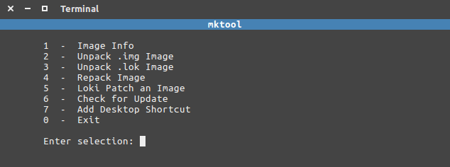

## mktool v3.1

mktool is for unpacking & repacking the android boot,
recovery, or loki images and also for loki patching.

**Tested on ubuntu & xubuntu**

**Project page:**
https://intechgeek.com/mktool/

### Resources
- [mkbootimg](https://github.com/osm0sis/mkbootimg)
- [loki](https://github.com/djrbliss/loki)
